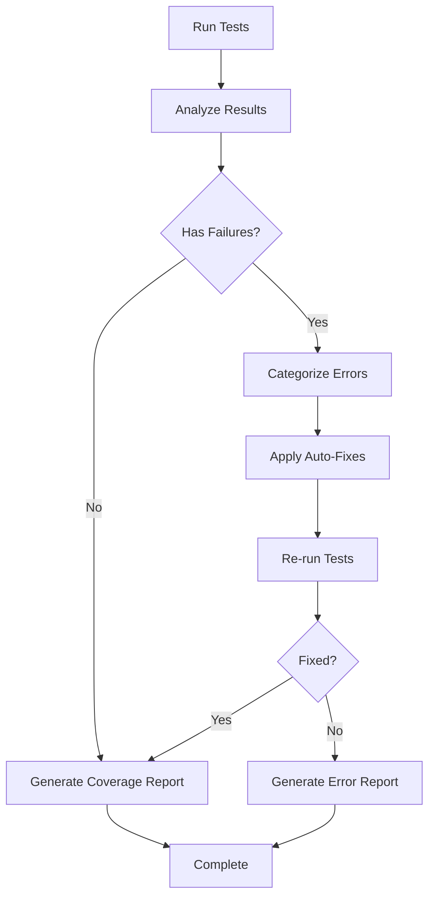

# Design Document

## Overview

The automated testing and error fixing system is designed to streamline the testing process by automatically identifying, categorizing, and fixing common test failures. The system analyzes test output, applies appropriate fixes, and ensures comprehensive test coverage across the multi-AI platform.

## Architecture

### Core Components

1. **Test Runner Manager**: Orchestrates test execution and monitors results
2. **Error Analyzer**: Categorizes and analyzes test failures
3. **Auto-Fix Engine**: Applies automated fixes for common issues
4. **Coverage Reporter**: Tracks and reports test coverage metrics
5. **Mock Generator**: Creates appropriate mocks for services and components

### System Flow



## Components and Interfaces

### Test Runner Manager

```typescript
interface TestRunnerManager {
  runTests(options?: TestOptions): Promise<TestResults>
  runTestsWithFixes(): Promise<TestResults>
  generateCoverageReport(): Promise<CoverageReport>
}

interface TestOptions {
  watch?: boolean
  coverage?: boolean
  pattern?: string
  maxWorkers?: number
}

interface TestResults {
  success: boolean
  totalTests: number
  passedTests: number
  failedTests: number
  failures: TestFailure[]
  coverage?: CoverageData
}
```

### Error Analyzer

```typescript
interface ErrorAnalyzer {
  analyzeFailures(failures: TestFailure[]): CategorizedErrors
  suggestFixes(error: TestError): Fix[]
}

interface CategorizedErrors {
  configurationErrors: ConfigError[]
  mockingErrors: MockError[]
  assertionErrors: AssertionError[]
  importErrors: ImportError[]
  asyncErrors: AsyncError[]
  domErrors: DOMError[]
}

interface Fix {
  type: FixType
  description: string
  filePath: string
  changes: FileChange[]
  confidence: number
}
```

### Auto-Fix Engine

```typescript
interface AutoFixEngine {
  applyFix(fix: Fix): Promise<FixResult>
  applyMultipleFixes(fixes: Fix[]): Promise<FixResult[]>
  canAutoFix(error: TestError): boolean
}

interface FixResult {
  success: boolean
  appliedChanges: FileChange[]
  error?: string
}
```

## Data Models

### Test Configuration

```typescript
interface TestConfig {
  preset: string
  testEnvironment: string
  setupFilesAfterEnv: string[]
  moduleNameMapping: Record<string, string>
  transform: Record<string, string>
  collectCoverageFrom: string[]
  coverageThreshold: CoverageThreshold
}

interface CoverageThreshold {
  global: {
    branches: number
    functions: number
    lines: number
    statements: number
  }
}
```

### Error Types

```typescript
enum ErrorType {
  CONFIGURATION = 'configuration',
  MOCKING = 'mocking',
  ASSERTION = 'assertion',
  IMPORT = 'import',
  ASYNC = 'async',
  DOM = 'dom',
  TYPESCRIPT = 'typescript'
}

interface TestError {
  type: ErrorType
  message: string
  stack: string
  filePath: string
  lineNumber?: number
  suggestions: string[]
}
```

## Error Handling

### Common Error Patterns and Fixes

1. **Jest Configuration Errors**
   - ES Module compatibility issues
   - Module name mapping problems
   - Transform configuration errors

2. **DOM Mocking Errors**
   - Missing scrollIntoView mock
   - Canvas context mocking
   - File API mocking

3. **Import/Export Errors**
   - TypeScript ES module issues
   - Dynamic import problems
   - Path resolution errors

4. **Async Testing Errors**
   - Unhandled promise rejections
   - Act() wrapper issues
   - Timeout problems

### Auto-Fix Strategies

```typescript
interface FixStrategy {
  pattern: RegExp
  fix: (match: RegExpMatchArray, context: FixContext) => Fix
  confidence: number
}

const commonFixes: FixStrategy[] = [
  {
    pattern: /moduleNameMapping.*Unknown option/,
    fix: (match, context) => ({
      type: FixType.CONFIG_UPDATE,
      description: 'Fix Jest moduleNameMapping typo',
      filePath: 'jest.config.js',
      changes: [{
        type: 'replace',
        oldText: 'moduleNameMapping',
        newText: 'moduleNameMapping'
      }],
      confidence: 0.95
    })
  },
  // More fix strategies...
]
```

## Testing Strategy

### Unit Tests
- Test each component in isolation
- Mock external dependencies
- Verify error detection and fixing logic
- Test configuration generation

### Integration Tests
- Test complete fix workflows
- Verify Jest configuration compatibility
- Test coverage reporting accuracy

### End-to-End Tests
- Run full test suite with auto-fixes
- Verify CI/CD pipeline compatibility
- Test error reporting and notifications

## Performance Considerations

- Parallel test execution for faster results
- Incremental fixing to avoid unnecessary re-runs
- Caching of successful fixes
- Optimized coverage collection

## Security Considerations

- Validate all file modifications before applying
- Restrict auto-fixes to safe, well-tested patterns
- Maintain audit log of all applied fixes
- Prevent execution of arbitrary code in fixes