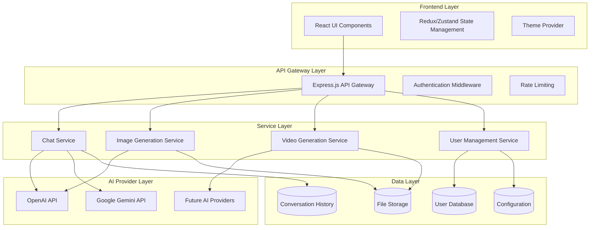

# Design Document

## Overview

多功能AI平台是一個現代化的Web應用程序，採用微服務架構設計，支持多種AI服務提供商的整合。平台使用React作為前端框架，Node.js/Express作為後端API服務，並採用插件式架構來支持未來的擴展需求。

## Architecture

### 系統架構圖



### 技術棧選擇

**前端:**
- React 18 with TypeScript
- Tailwind CSS for styling
- Zustand for state management
- React Query for API data fetching
- React Router for navigation

**後端:**
- Node.js with Express.js
- TypeScript
- Prisma ORM for database operations
- JWT for authentication
- Multer for file uploads

**數據庫:**
- PostgreSQL for structured data
- Redis for session management and caching

**部署:**
- Docker containers
- Nginx as reverse proxy
- Cloud storage for generated files

## Components and Interfaces

### Frontend Components

#### Core UI Components
```typescript
// Theme Provider Component
interface ThemeContextType {
  theme: 'light' | 'dark';
  toggleTheme: () => void;
}

// AI Service Selector
interface AIServiceSelectorProps {
  selectedService: string;
  availableServices: AIService[];
  onServiceChange: (service: string) => void;
}

// Parameter Control Panel
interface ParameterControlProps {
  parameters: AIParameters;
  onParameterChange: (key: string, value: any) => void;
  serviceType: string;
}

// Chat Interface
interface ChatInterfaceProps {
  messages: Message[];
  onSendMessage: (message: string) => void;
  isLoading: boolean;
}
```

#### Service Integration Components
```typescript
// AI Service Factory
interface AIServiceFactory {
  createChatService(provider: string): ChatServiceInterface;
  createImageService(provider: string): ImageServiceInterface;
  createVideoService(provider: string): VideoServiceInterface;
}

// Generic AI Service Interface
interface AIServiceInterface {
  provider: string;
  supportedParameters: ParameterDefinition[];
  makeRequest(input: any, parameters: any): Promise<any>;
}
```

### Backend API Interfaces

#### REST API Endpoints
```typescript
// Chat API
POST /api/chat/send
GET /api/chat/history/:conversationId
DELETE /api/chat/conversation/:id

// Image Generation API
POST /api/image/generate
GET /api/image/:id
DELETE /api/image/:id

// Video Generation API
POST /api/video/generate
GET /api/video/:id/status
GET /api/video/:id/download

// User Management API
POST /api/auth/register
POST /api/auth/login
GET /api/user/profile
PUT /api/user/preferences
```

#### Service Layer Interfaces
```typescript
// Chat Service Interface
interface ChatService {
  sendMessage(
    provider: string,
    message: string,
    parameters: ChatParameters,
    conversationId?: string
  ): Promise<ChatResponse>;
  
  getConversationHistory(conversationId: string): Promise<Message[]>;
}

// Image Service Interface
interface ImageService {
  generateImage(
    provider: string,
    prompt: string,
    parameters: ImageParameters
  ): Promise<ImageResponse>;
  
  getImageStatus(imageId: string): Promise<GenerationStatus>;
}
```

## Data Models

### User and Authentication
```typescript
interface User {
  id: string;
  email: string;
  username: string;
  preferences: UserPreferences;
  createdAt: Date;
  updatedAt: Date;
}

interface UserPreferences {
  theme: 'light' | 'dark';
  defaultAIProvider: string;
  defaultParameters: Record<string, any>;
  language: string;
}
```

### Conversation and Messages
```typescript
interface Conversation {
  id: string;
  userId: string;
  title: string;
  aiProvider: string;
  parameters: Record<string, any>;
  createdAt: Date;
  updatedAt: Date;
}

interface Message {
  id: string;
  conversationId: string;
  role: 'user' | 'assistant';
  content: string;
  timestamp: Date;
  metadata?: Record<string, any>;
}
```

### AI Service Configuration
```typescript
interface AIProviderConfig {
  id: string;
  name: string;
  type: 'chat' | 'image' | 'video';
  apiEndpoint: string;
  apiKeyRequired: boolean;
  supportedParameters: ParameterDefinition[];
  rateLimits: RateLimit[];
}

interface ParameterDefinition {
  key: string;
  type: 'number' | 'string' | 'boolean' | 'select';
  defaultValue: any;
  min?: number;
  max?: number;
  options?: string[];
  description: string;
}
```

### Generated Content
```typescript
interface GeneratedImage {
  id: string;
  userId: string;
  prompt: string;
  provider: string;
  parameters: Record<string, any>;
  imageUrl: string;
  status: 'pending' | 'completed' | 'failed';
  createdAt: Date;
}

interface GeneratedVideo {
  id: string;
  userId: string;
  prompt: string;
  provider: string;
  parameters: Record<string, any>;
  videoUrl?: string;
  thumbnailUrl?: string;
  status: 'pending' | 'processing' | 'completed' | 'failed';
  progress: number;
  createdAt: Date;
}
```

## Error Handling

### Frontend Error Handling
```typescript
// Global Error Boundary
class GlobalErrorBoundary extends React.Component {
  // Handle React component errors
}

// API Error Handler
interface APIError {
  code: string;
  message: string;
  details?: any;
}

// Error Toast System
interface ErrorToastService {
  showError(error: APIError): void;
  showNetworkError(): void;
  showRateLimitError(retryAfter: number): void;
}
```

### Backend Error Handling
```typescript
// Custom Error Classes
class AIServiceError extends Error {
  constructor(
    public provider: string,
    public code: string,
    message: string
  ) {
    super(message);
  }
}

class RateLimitError extends Error {
  constructor(
    public retryAfter: number,
    message: string
  ) {
    super(message);
  }
}

// Error Middleware
interface ErrorHandler {
  handleAIServiceError(error: AIServiceError): Response;
  handleRateLimitError(error: RateLimitError): Response;
  handleValidationError(error: ValidationError): Response;
}
```

### AI Provider Error Handling
```typescript
// Provider-specific error mapping
interface ProviderErrorMapper {
  mapOpenAIError(error: any): AIServiceError;
  mapGeminiError(error: any): AIServiceError;
  mapGenericError(error: any): AIServiceError;
}

// Retry Logic
interface RetryConfig {
  maxRetries: number;
  backoffStrategy: 'exponential' | 'linear';
  retryableErrors: string[];
}
```

## Testing Strategy

### Frontend Testing
```typescript
// Component Testing with React Testing Library
describe('ChatInterface', () => {
  test('sends message when form is submitted');
  test('displays loading state during API call');
  test('handles error states gracefully');
});

// Integration Testing
describe('AI Service Integration', () => {
  test('switches between different AI providers');
  test('applies parameter changes correctly');
  test('maintains conversation context');
});
```

### Backend Testing
```typescript
// Unit Testing for Services
describe('ChatService', () => {
  test('formats OpenAI API requests correctly');
  test('handles API rate limits');
  test('saves conversation history');
});

// API Integration Testing
describe('Chat API Endpoints', () => {
  test('POST /api/chat/send returns valid response');
  test('handles authentication properly');
  test('validates input parameters');
});
```

### End-to-End Testing
```typescript
// E2E Testing with Playwright
describe('User Workflows', () => {
  test('complete chat conversation flow');
  test('image generation and download flow');
  test('theme switching persistence');
  test('parameter adjustment effects');
});
```

### AI Provider Testing
```typescript
// Mock AI Services for Testing
interface MockAIService {
  simulateSuccess(): Promise<any>;
  simulateRateLimit(): Promise<never>;
  simulateError(): Promise<never>;
}

// Provider Integration Tests
describe('AI Provider Integration', () => {
  test('OpenAI API integration');
  test('Gemini API integration');
  test('fallback behavior when provider fails');
});
```

## Security Considerations

### API Key Management
- 所有AI服務的API密鑰存儲在環境變量中
- 使用加密存儲用戶的個人API密鑰（如果允許用戶提供）
- 實施API密鑰輪換機制

### Rate Limiting and Abuse Prevention
- 實施用戶級別的請求限制
- 監控異常使用模式
- 實施CAPTCHA防止自動化濫用

### Data Privacy
- 用戶對話數據加密存儲
- 實施數據保留政策
- 提供用戶數據導出和刪除功能

### Authentication and Authorization
- JWT token with refresh mechanism
- Role-based access control
- Session management with Redis

## Performance Optimization

### Frontend Optimization
- Code splitting by route and feature
- Image lazy loading and optimization
- Virtual scrolling for long conversation histories
- Service Worker for offline functionality

### Backend Optimization
- Connection pooling for database
- Redis caching for frequently accessed data
- Request queuing for AI service calls
- CDN for static assets and generated content

### AI Service Optimization
- Request batching where possible
- Intelligent caching of similar requests
- Load balancing across multiple API keys
- Graceful degradation when services are unavailable